# Governance Experiments: Exploring the Parameter Space

**For researchers and governance designers.**

This case study walks through Votiverse's governance parameter space — the 13 configurable parameters that define how a group makes decisions. Rather than telling one group's story, it compares four governance models side by side, showing how the same platform adapts to fundamentally different decision-making philosophies.

---

## The Parameter Space

Votiverse's governance is defined by two primary axes for delegation and a handful of ballot and feature parameters. The delegation axes form a 2×2 grid:

|  | No transfers | Transfers |
|---|---|---|
| **No candidates** | Direct democracy | Informal liquid |
| **Candidates** | Representative | Liquid delegation |

- **Candidacy** — Is there a formal system for declaring "I'm willing to represent others"?
- **Transferable** — Can delegated voting power flow through chains?

Each quadrant produces a recognizably different governance experience. The rest of this case study shows what each looks like in practice.

---

## Act 1: One Platform, Multiple Models

Marcus Chen is a member of three groups, each using a different governance model. His dashboard shows active votes across all of them.

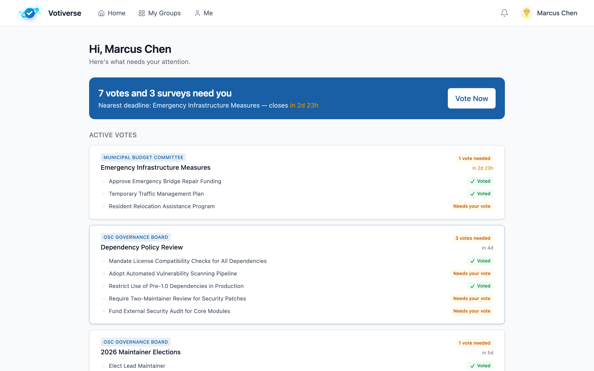

His "My Groups" page shows the governance label for each — a quick way to see what kind of decision-making each group uses.

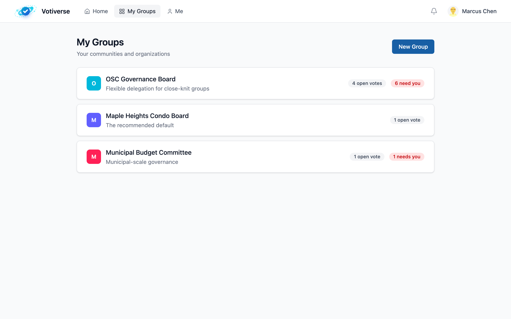

Elena Vasquez belongs to two groups that sit at opposite ends of the delegation spectrum: Greenfield Community Council (Direct Democracy) and Maple Heights Condo Board (Liquid Delegation).

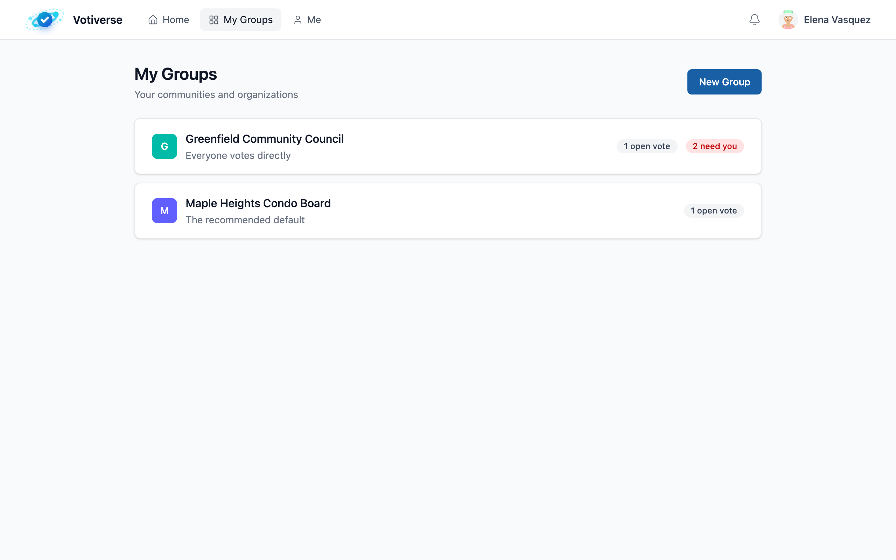

---

## Act 2: Direct Democracy — No Delegation

**Greenfield Community Council** uses the Direct Democracy preset: `candidacy=false, transferable=false`. Every member votes on every question. There is no delegation mechanism.

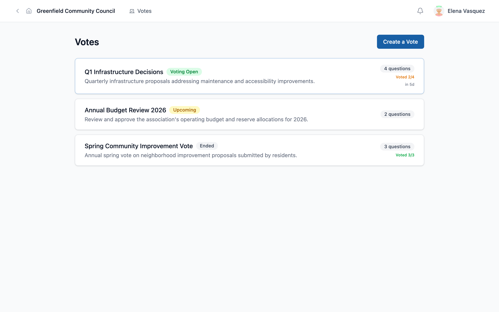

The navigation bar reflects this — there are no Delegates, Topics, or Candidates tabs. The only tabs are Votes and the group settings. When delegation is disabled, the platform removes all delegation-related UI.

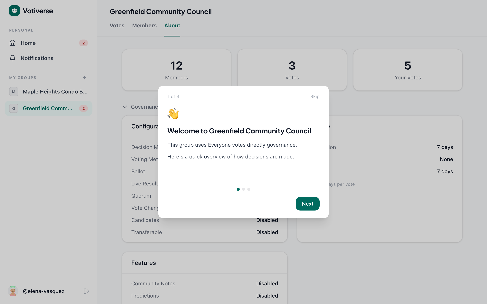

The configuration confirms: no candidates, no transfers. Secret ballot, majority rule.

**What this model is good for:** Small groups (5–20 people) where everyone can participate directly. Clubs, parent committees, reading groups. Adding delegation infrastructure would be overhead.

**What to watch for in experiments:** Participation rates. When groups grow beyond 15–20 members, direct democracy often sees declining turnout. This is the signal that delegation might help.

---

## Act 3: Liquid Open — Informal Delegation Without Candidates

**OSC Governance Board** uses Liquid Open: `candidacy=false, transferable=true`. Anyone can delegate to anyone — there is no formal candidate system. Delegation chains flow freely.

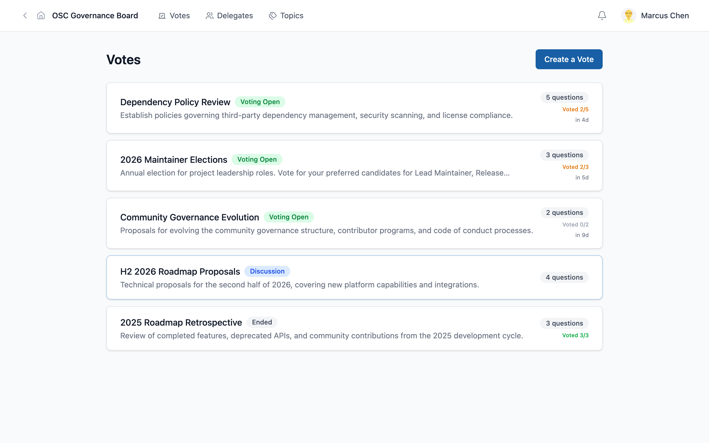

The Delegates tab appears (delegation is enabled via `transferable=true`), but there is no Candidates tab — no one needs to formally declare.

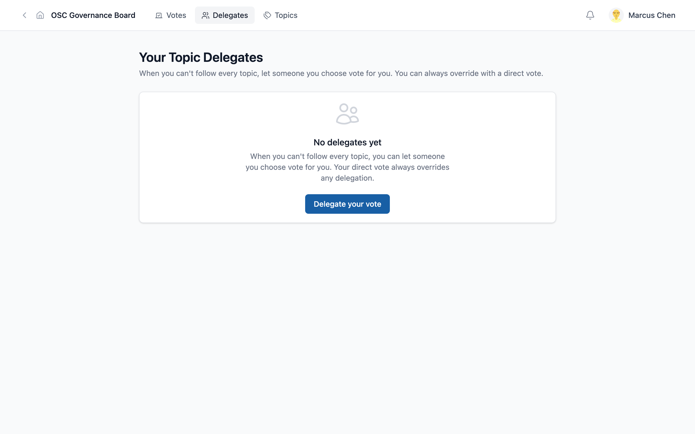

The configuration shows the distinctive Liquid Open pattern: public ballots with live results. This group deliberates in the open — you can see where the group is leaning and adjust your position.

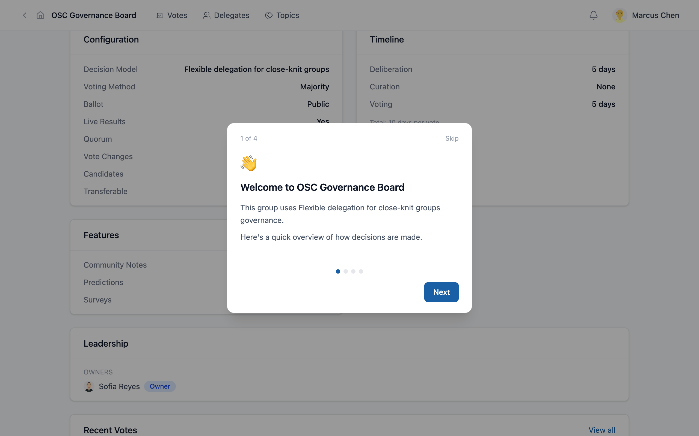

**What this model is good for:** Groups with high trust where everyone knows each other. Tech communities, professional associations, cooperatives. The absence of formal candidates keeps things lightweight.

**What to watch for in experiments:** Power concentration. Without candidate profiles and accountability structures, delegation can silently concentrate. Track the Gini coefficient of voting weight over time.

---

## Act 4: Representative — Classic Proxy Voting

**Board of Directors** uses the Representative preset: `candidacy=true, transferable=false`. Members appoint a declared candidate as their proxy. The proxy votes on their behalf but cannot pass the vote further — chains are limited to one hop.

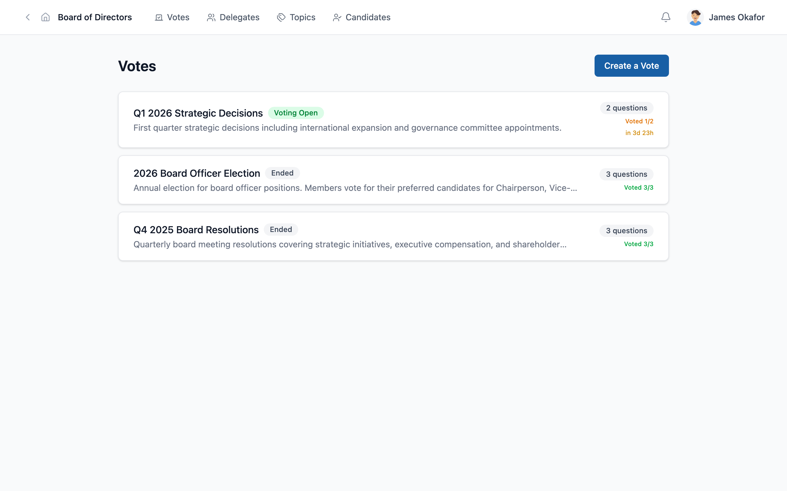

The Delegates tab and Candidates tab both appear. This is the key difference from Liquid Open: delegates must formally declare their candidacy.

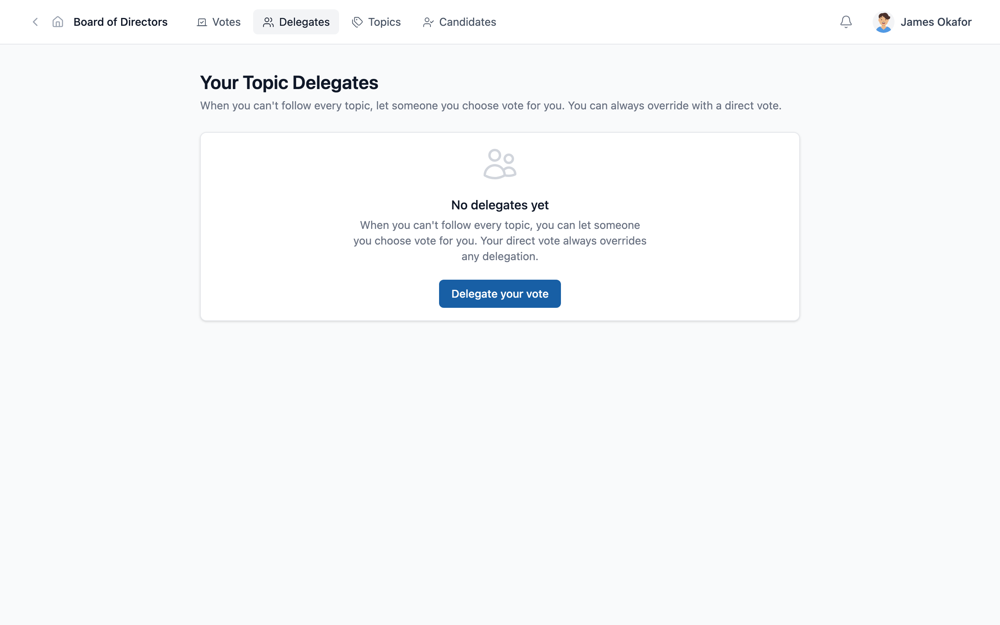

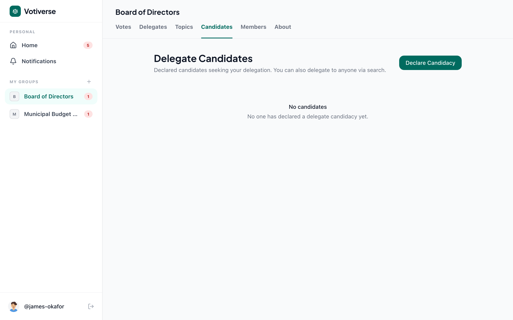

The configuration confirms: candidates enabled, transfers disabled. High quorum (50%) ensures legitimacy. Short timelines for focused decision-making.

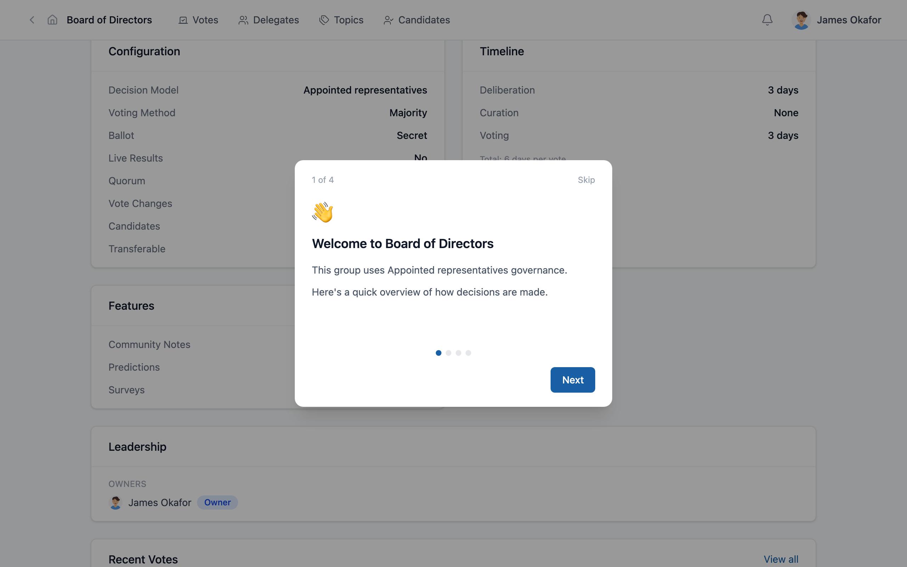

**What this model is good for:** Corporate boards, HOAs, unions, formal committees. Any context where representatives have a fiduciary duty and must be explicitly authorized.

**What to watch for in experiments:** Whether non-transitive delegation creates representation gaps. If your representative is absent, your vote is lost — there is no chain to carry it further.

---

## Act 5: Liquid Delegation — The Recommended Default

**Maple Heights Condo Board** uses Liquid Delegation: `candidacy=true, transferable=true`. Candidates exist for discoverability and accountability, but anyone can delegate to anyone. Chains are transitive. Community notes provide crowd-sourced verification. Surveys, predictions, and a curation phase round out the model.

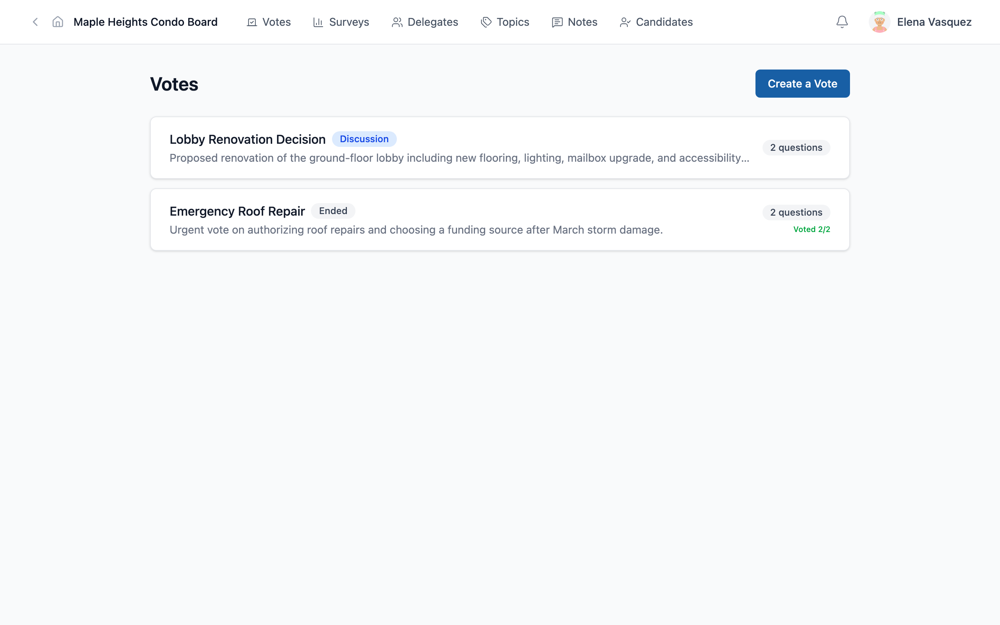

The navigation bar shows the full feature set: Votes, Surveys, Delegates, Topics, Notes, Candidates. Every governance tool is active.

Topic-scoped delegation lets members choose different delegates for different areas of governance.

Community notes provide crowd-sourced verification on proposals and candidate profiles.

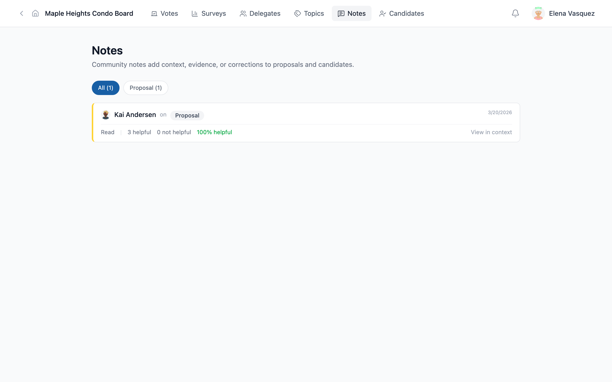

The configuration shows all features enabled, with a structured timeline: 7 days deliberation, 2 days curation, 7 days voting.

**What this model is good for:** Any group that wants a well-rounded governance system. The combination of liquid delegation, community notes, and structured deliberation synthesizes ideas from Swiss direct democracy, liquid democracy, and social media verification.

**What to watch for in experiments:** How delegation patterns change over time. Do members start by voting directly and gradually delegate as trust develops? Do community notes actually affect vote outcomes?

---

## Act 6: Creating a New Experiment

To create a new group with a custom governance configuration, click "New Group" from the My Groups page. The form presents the key choices directly:

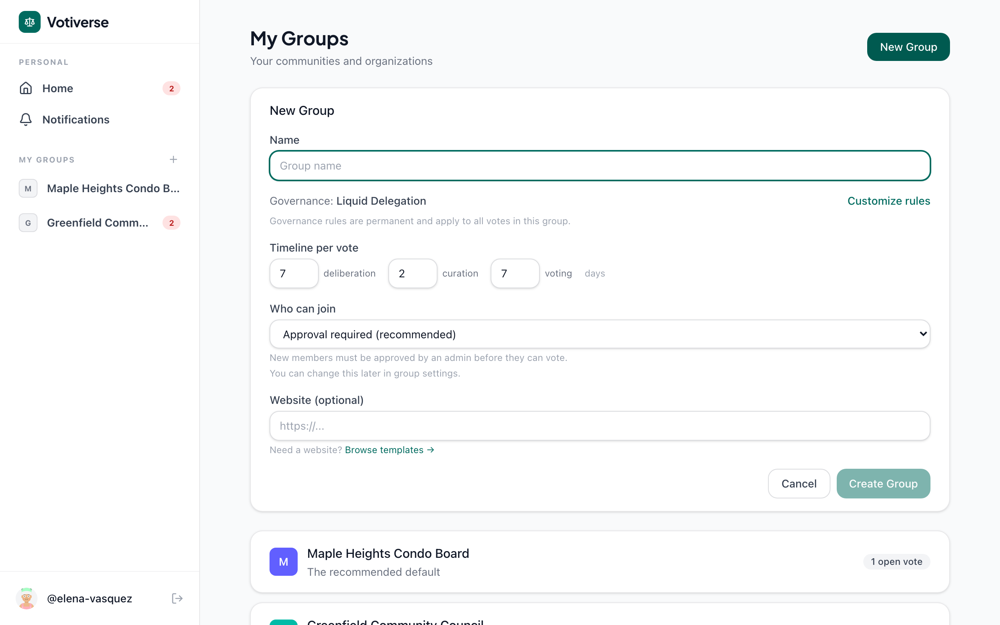

The governance preset defaults to Liquid Delegation, and the timeline inputs (deliberation, curation, voting days) appear directly in the form — not behind an "advanced settings" screen.

Click "Customize rules" to adjust any of the 13 parameters. The modal organizes them into three sections:

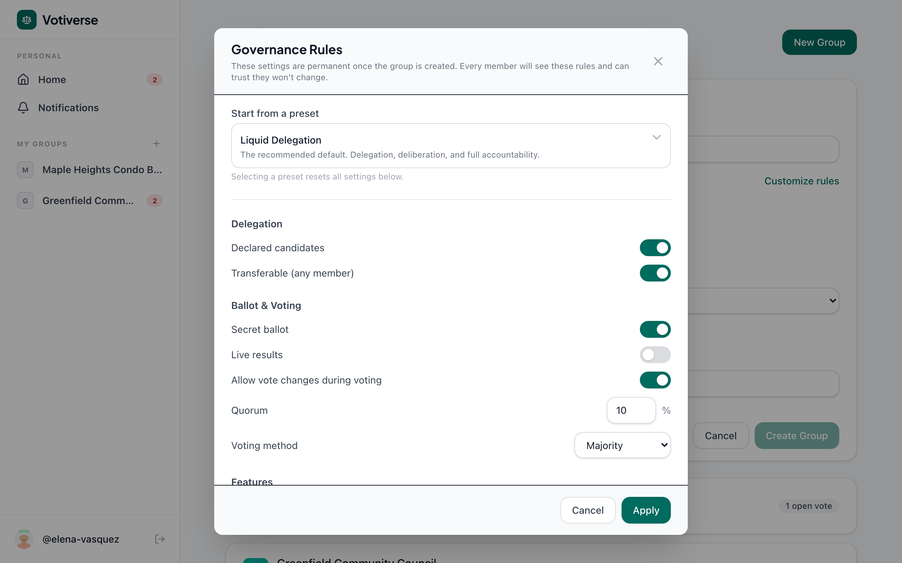

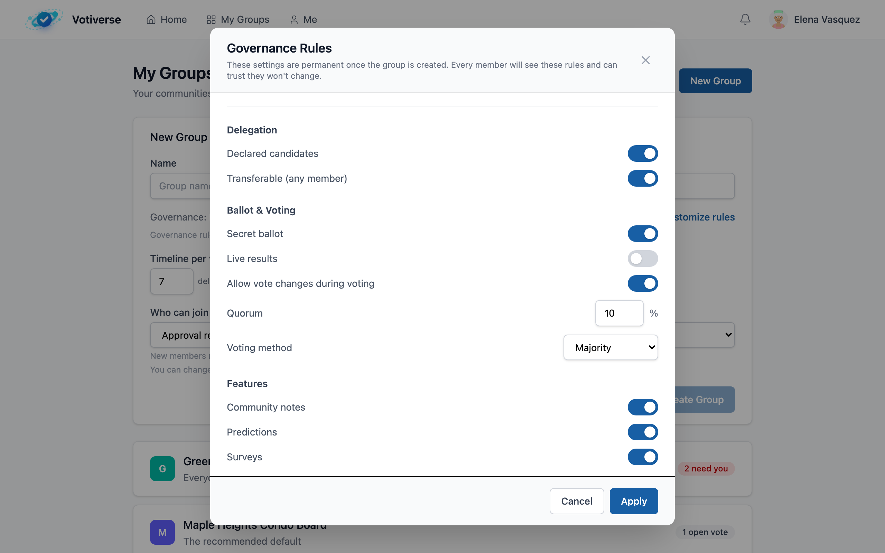

Every combination of parameters is valid. Researchers can create configurations that don't match any named preset — for example, direct democracy with community notes, or representative mode with live results.

---

## The 13 Parameters

| Section | Parameter | Type | Default (Liquid Delegation) |
|---|---|---|---|
| **Delegation** | Candidacy | boolean | true |
|  | Transferable | boolean | true |
| **Ballot** | Secret ballot | boolean | true |
|  | Live results | boolean | false |
|  | Allow vote change | boolean | true |
|  | Quorum | 0–100% | 10% |
|  | Voting method | majority / supermajority | majority |
| **Features** | Community notes | boolean | true |
|  | Predictions | boolean | true |
|  | Surveys | boolean | true |
| **Timeline** | Deliberation days | integer ≥ 1 | 7 |
|  | Curation days | integer ≥ 0 | 2 |
|  | Voting days | integer ≥ 1 | 7 |

---

## Named Presets

| Preset | Candidacy | Transferable | Ballot | Key difference |
|---|---|---|---|---|
| **Liquid Delegation** | yes | yes | secret, sealed | Full-featured default |
| **Direct Democracy** | no | no | secret, sealed | No delegation at all |
| **Swiss Votation** | no | no | secret, sealed, 20% quorum | Direct + deliberation structure + community notes |
| **Liquid Open** | no | yes | public, live | Informal liquid, no candidate profiles |
| **Representative** | yes | no | secret, sealed, 50% quorum | Classic proxy, non-transitive |
| **Civic Participatory** | yes | yes | secret, sealed, 14d timelines | Municipal scale |

---

## Research Questions

The parameter space enables controlled experiments. Some questions worth investigating:

1. **Does candidacy improve accountability?** Compare Liquid Open (no candidates) vs Liquid Delegation (with candidates) on the same population. Measure: delegate turnover, community note activity, delegation concentration.

2. **Does transitivity concentrate or distribute power?** Compare Representative (non-transitive) vs Liquid Delegation (transitive) with the same candidate pool. Measure: Gini coefficient of voting weight, chain length distribution.

3. **Do live results change behavior?** Compare secret/sealed (Liquid Delegation default) vs public/live (Liquid Open). Measure: vote change frequency, bandwagon effects, minority position persistence.

4. **Does the curation phase affect outcomes?** Compare Direct Democracy (no curation) vs Swiss Votation (2-day curation). Measure: proposal quality, endorsement distribution, community note density.

5. **What is the participation threshold for delegation?** Run groups of increasing size under Direct Democracy. At what size does participation drop below the quorum? Does switching to Liquid Delegation recover it?

---

## What This Demonstrates

| Feature | Governance principle |
|---|---|
| Two-axis delegation grid | Orthogonal design — every combination is valid and produces a distinct model |
| Per-assembly configuration | Configuration is data — the engine interprets rules, never hard-codes them |
| UI adapts to config | Tabs, pages, and features appear/disappear based on what's enabled |
| 13 parameters, 6 presets | Named presets for common models; full parameter control for researchers |
| Timeline in main form | Operational settings (how long?) separate from structural settings (how does it work?) |
