# Case Study: Maple Heights Condo Board

*How a 24-unit condominium uses Votiverse to make transparent, accountable decisions about their shared building.*

---

## The Setting

Maple Heights is a mid-size condo complex where residents collectively own the building and make decisions about maintenance, renovations, and finances. Like many condos, they've struggled with low engagement at board meetings, unclear decision processes, and a few vocal owners dominating discussions while others feel left out.

The board president, Elena Vasquez, decides to bring governance online using Votiverse.

---

## Act 1: Creating the Group

Elena signs in and creates a new group for the condo board.

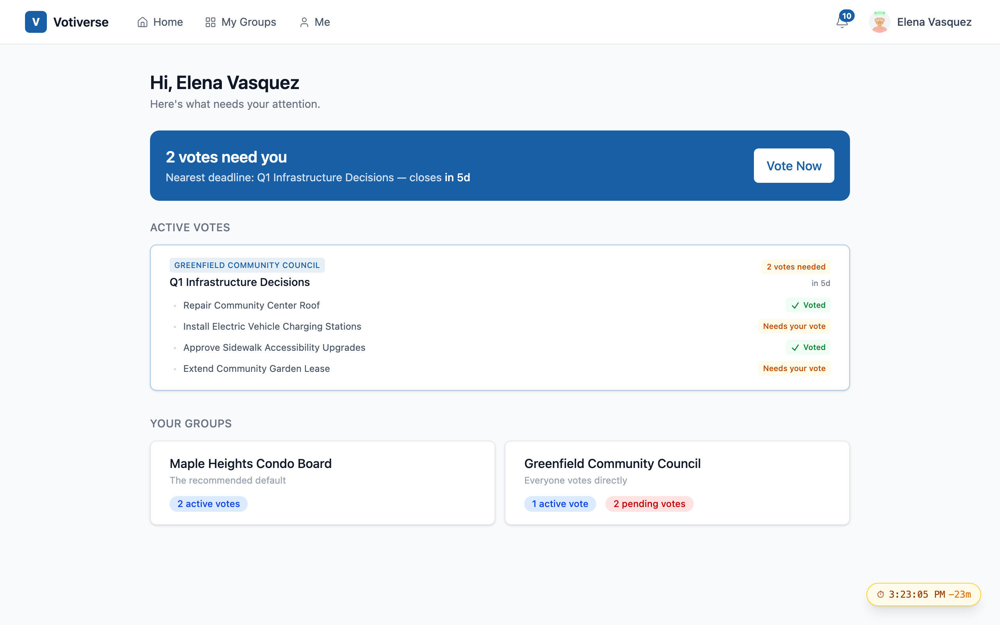

She navigates to **My Groups** and clicks **New Group**.

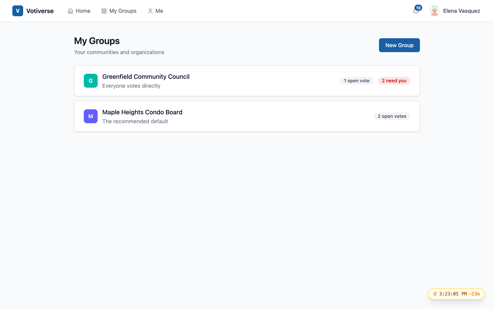

The group creation form asks for a name and lets her choose governance rules. The default — **Modern Democracy** — provides a good balance: delegation through declared candidates, structured deliberation periods, secret ballots, community notes for fact-checking, and surveys for collecting member observations.

Crucially, she also selects the **admission mode**. The default is **Approval required**, which means anyone who receives an invite link must be approved by an admin before they can vote. This protects against Sybil attacks — a bad actor creating fake accounts to manipulate votes.

> *In a governance platform, the integrity of membership is the integrity of democracy. Every fake account dilutes the voice of real participants.*

---

## Act 2: Onboarding New Members

After creating the group, Elena lands on the assembly dashboard where an **onboarding dialog** walks her through how governance works in this group:

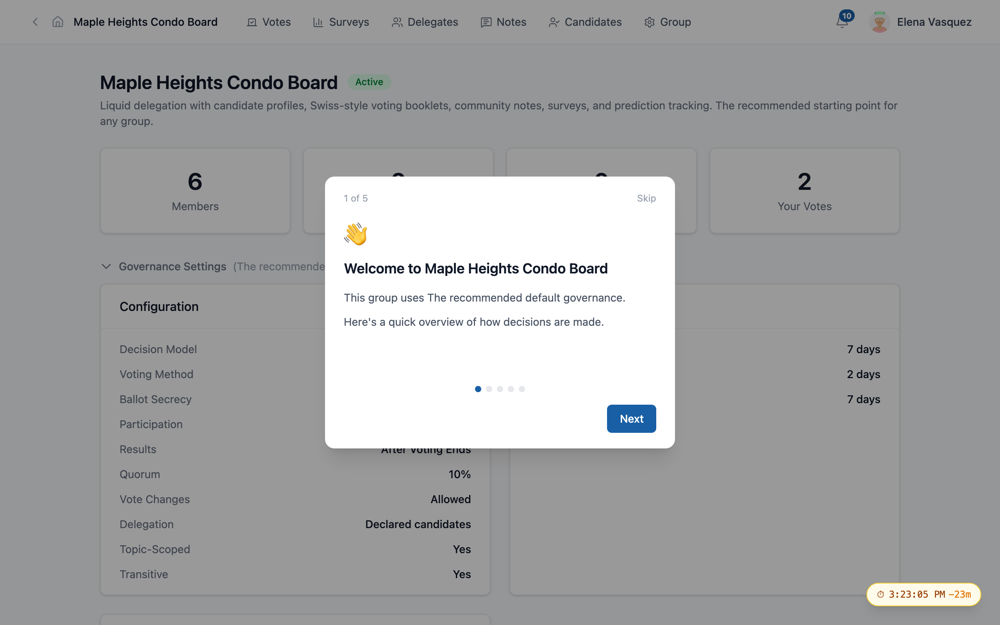

The dialog is **config-driven** — it only shows steps relevant to this group's settings. A group with no delegation wouldn't see the delegation step. A group without community notes wouldn't see that explanation.

### Inviting the Board

Elena goes to the **Members** page and invites fellow board members by their handles — direct invitations that bypass the approval step since she's personally selecting each person.

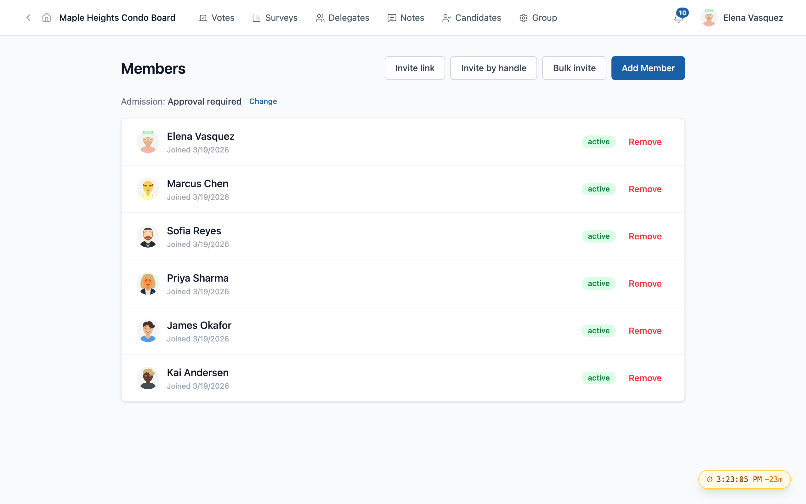

She also generates an **invite link** for the broader owner community. The link shows the expiration date and a clear message: *"Recipients will need admin approval before they can join and vote."*

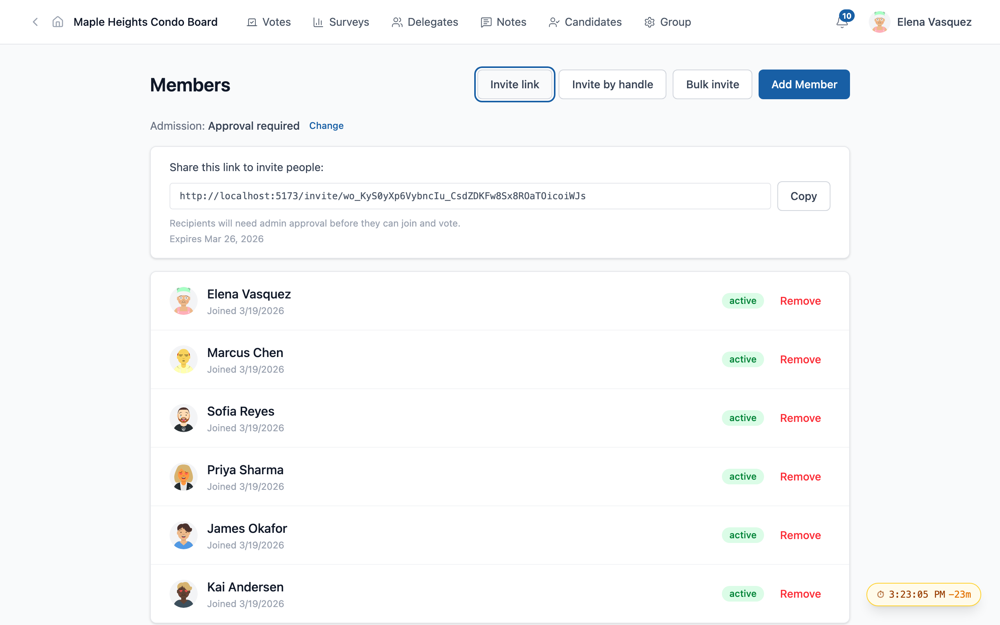

### The Invite Experience

When Sofia Reyes, a new owner, opens the invite link, she sees a **public preview** of the group — governance rules, leadership, member count — before deciding whether to join.

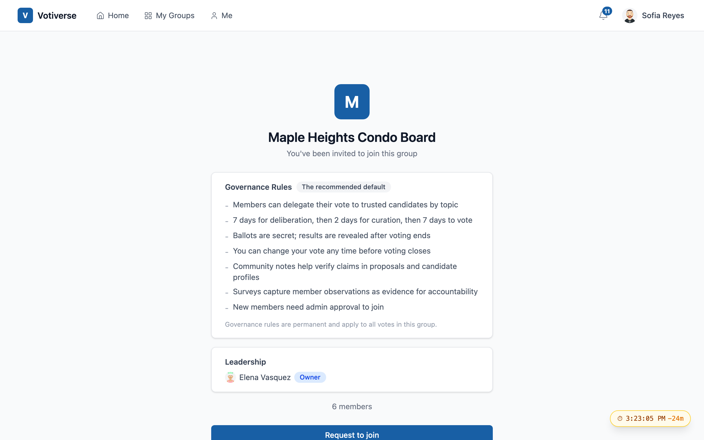

The button says **"Request to join"** (not "Join"), making it clear that admin approval is required:

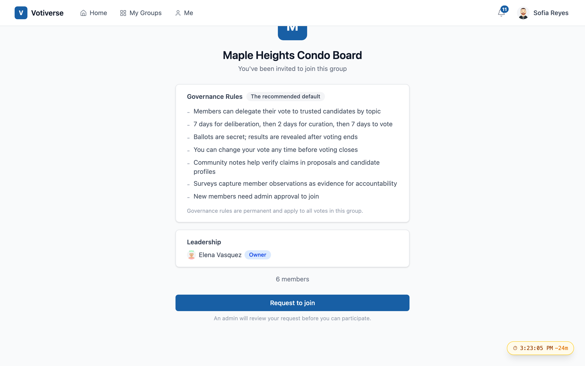

After Sofia clicks, she sees a confirmation that her request has been submitted. She doesn't gain access yet — an admin must review it first.

### Admin Notification

Elena receives a **notification** in her bell icon: *"Sofia Reyes wants to join Maple Heights Condo Board."* Clicking it takes her to the Members page where she can approve or reject the request.

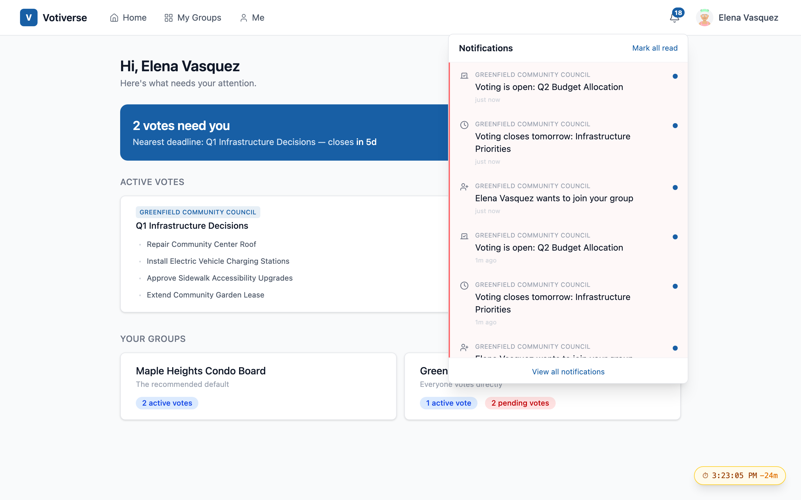

The notification hub supports three urgency levels:
- **Action** (red tint): requires your response — votes to cast, requests to approve
- **Timely** (blue tint): time-sensitive awareness — new events, approaching deadlines
- **Info** (no tint): for your records — results published, requests approved

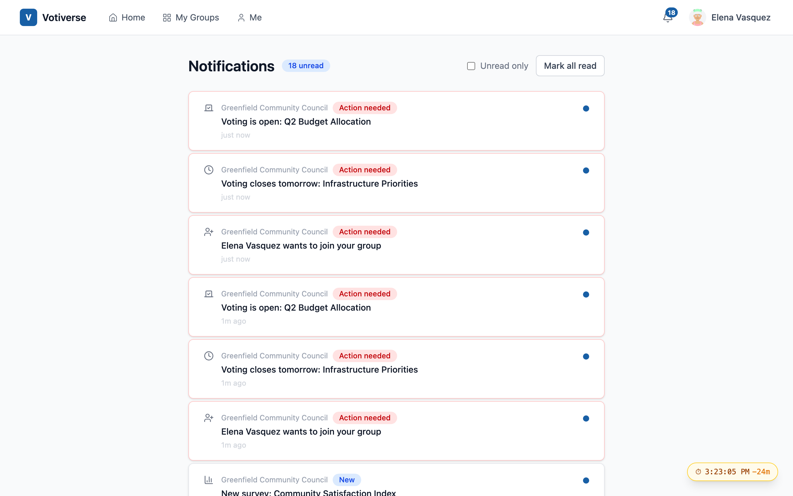

---

## Act 3: The First Vote — Emergency Roof Repair

After storm damage, Elena creates a voting event: **Emergency Roof Repair** with two questions:
1. *Authorize $45,000 emergency roof repair*
2. *Funding source for the repair*

The event enters the **Discussion** phase — 7 days for members to review, ask questions, and submit proposals before voting begins.

### Writing a Proposal

Marcus Chen, the condo treasurer, writes a detailed proposal using the **rich text editor**. He structures it with headings, paragraphs, and bullet lists to present a clear cost analysis:

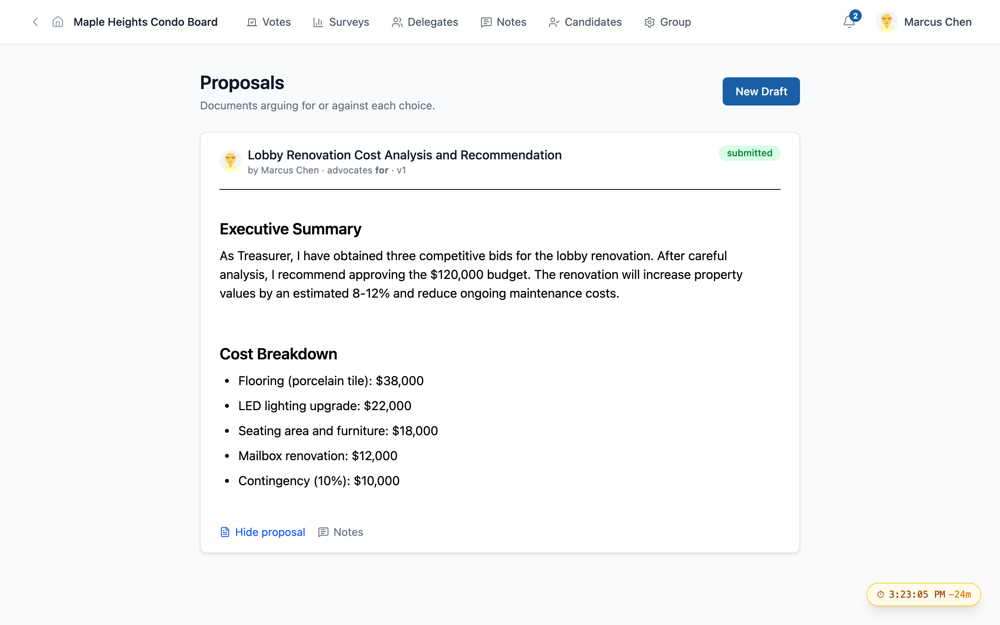

The proposal includes:
- An **Executive Summary** with the treasurer's recommendation
- A **Cost Breakdown** with 5 line items totaling $120,000
- A clear position: **advocates for** the renovation

### Community Notes: Fact-Checking

Kai Andersen, a skeptical owner, reads Marcus's proposal and adds a **community note** challenging the cost estimates:

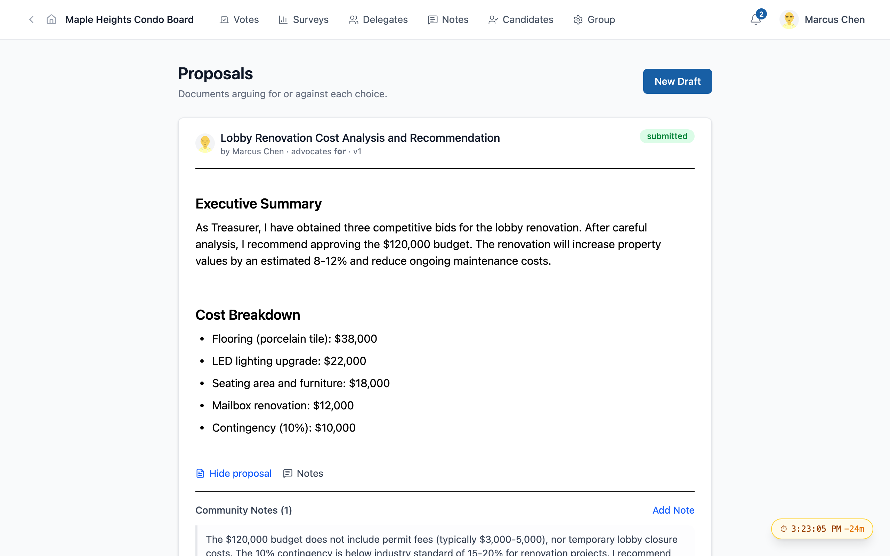

> *"The $120,000 budget does not include permit fees (typically $3,000-5,000), nor temporary lobby closure costs. The 10% contingency is below industry standard of 15-20%."*

Other members can evaluate the note as **Helpful** or **Not helpful**. Notes become more visible as they receive positive evaluations — this is how the community self-moderates information quality without central censorship.

### Casting Votes

When the discussion period ends, the event transitions to **Voting Open**. Members see the voting buttons and can cast their vote:

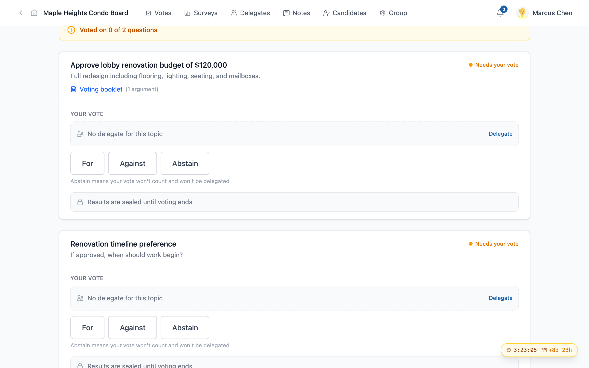

Key governance features visible here:
- **Secret ballot** — votes are sealed until voting ends
- **Vote changes allowed** — you can change your mind before the deadline
- **Delegation available** — busy members can delegate to someone they trust
- **"No delegate for this topic"** — with a link to set one up

After voting, you see confirmation of your choice with an option to change it:

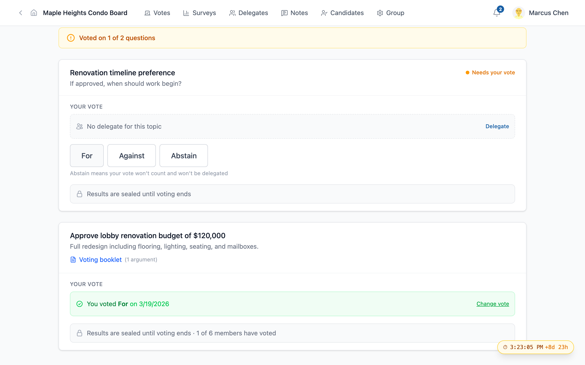

### Results Revealed

When the voting window closes, results are revealed to everyone simultaneously:

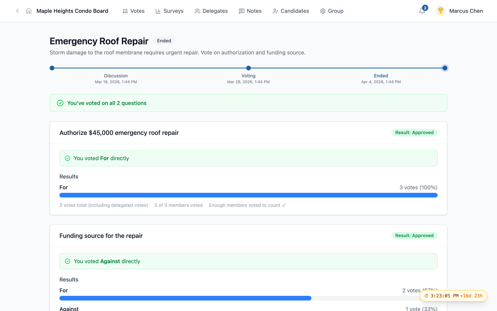

The roof repair was **approved unanimously** (3-0). The funding question passed 2-1 — Marcus voted against using the reserve fund, preferring a special assessment.

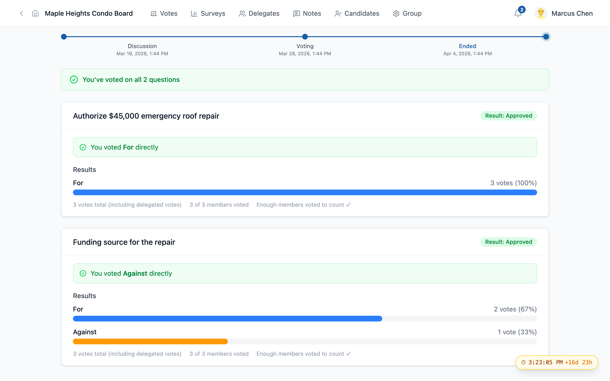

The results display shows:
- **"Result: Approved"** badge
- Bar chart with vote breakdown by choice
- Total votes, participation rate, quorum check
- Each member's own vote (visible to themselves)

---

## What This Demonstrates

The Maple Heights scenario exercises the full governance lifecycle:

| Phase | What Happens | Governance Principle |
|-------|-------------|---------------------|
| Group creation | Elena chooses governance rules | Configuration is data — rules are permanent |
| Admission control | Approval mode prevents Sybil attacks | Identity integrity protects one-person-one-vote |
| Onboarding | Config-driven dialog teaches governance | Transparency — members understand the system |
| Invite link | Public preview before joining | Informed consent — see rules before committing |
| Proposal writing | Structured arguments with rich text | Deliberation before decision |
| Community notes | Fact-checking by peers | Self-moderating information quality |
| Secret ballot | Votes sealed until close | Free participation without coercion |
| Results | Simultaneous reveal with full data | Accountability through transparency |

Every feature serves a purpose rooted in democratic theory. The platform doesn't just facilitate voting — it structures the entire lifecycle of collective decision-making.

---

## Technical Notes

All screenshots in this case study were captured from a running Votiverse instance using Playwright. The data was created through the actual UI and API — no mockups.

To reproduce this scenario:
1. Run the three servers (VCP, backend, web)
2. Execute the screenshot script: `npx tsx docs/case-study/take-screenshots.ts`
3. The script walks through the full scenario, capturing 20 screenshots at key moments

See [`docs/testing/condo-board-scenario.md`](../testing/condo-board-scenario.md) for the full test script with character descriptions and API details.
