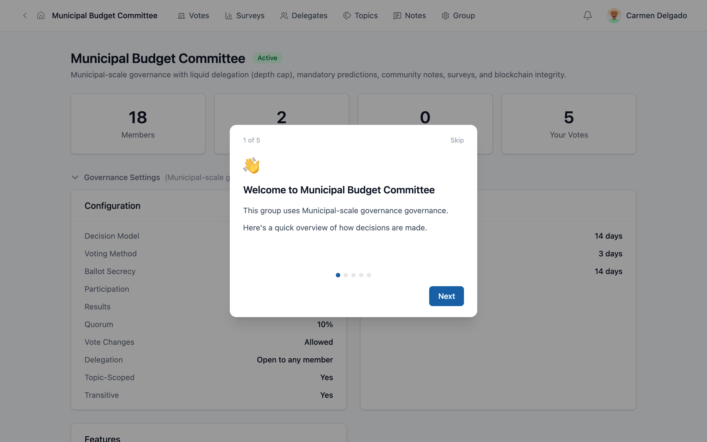
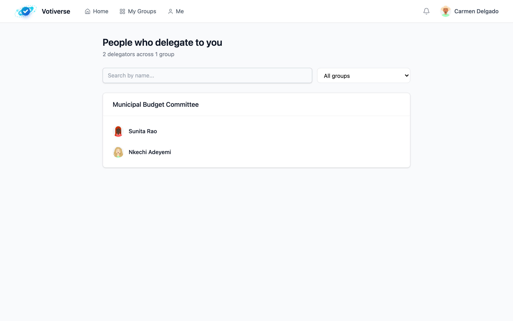
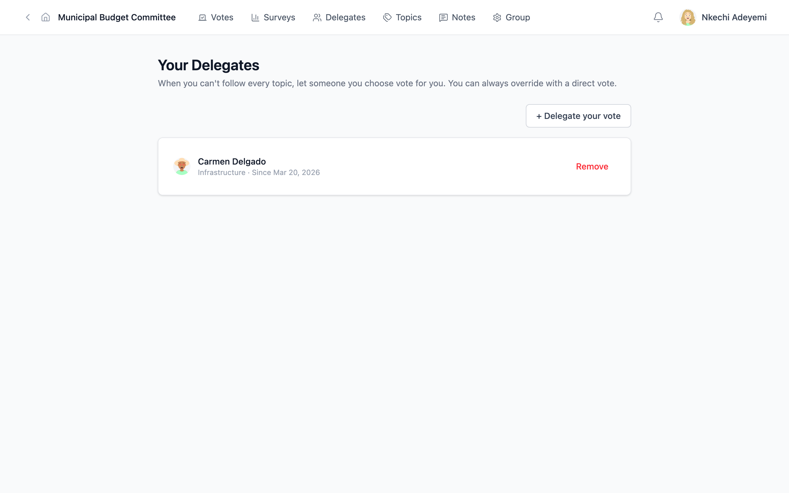
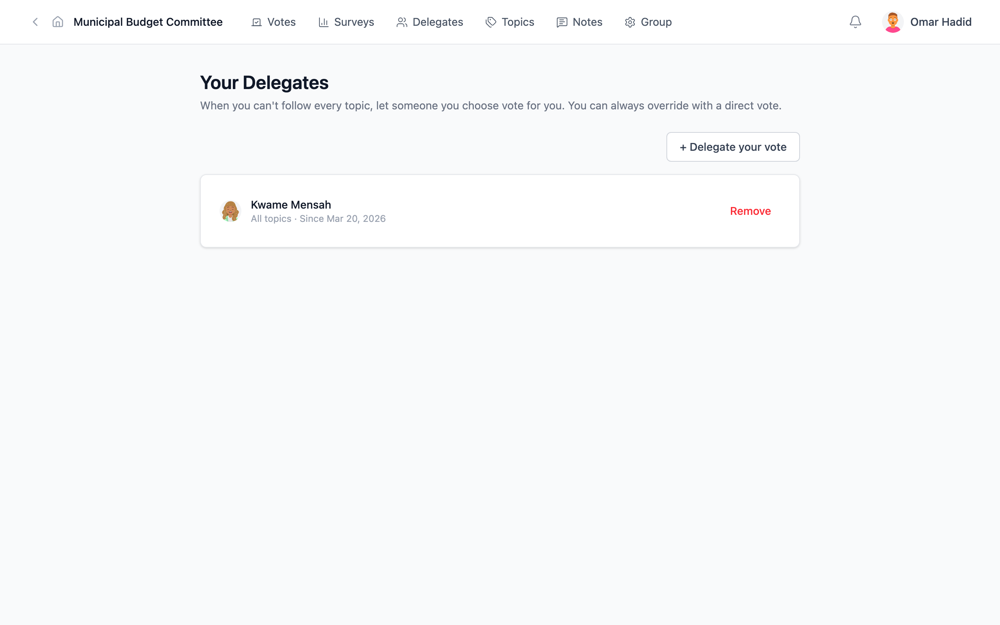
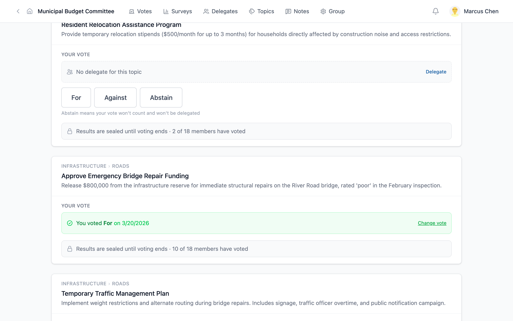
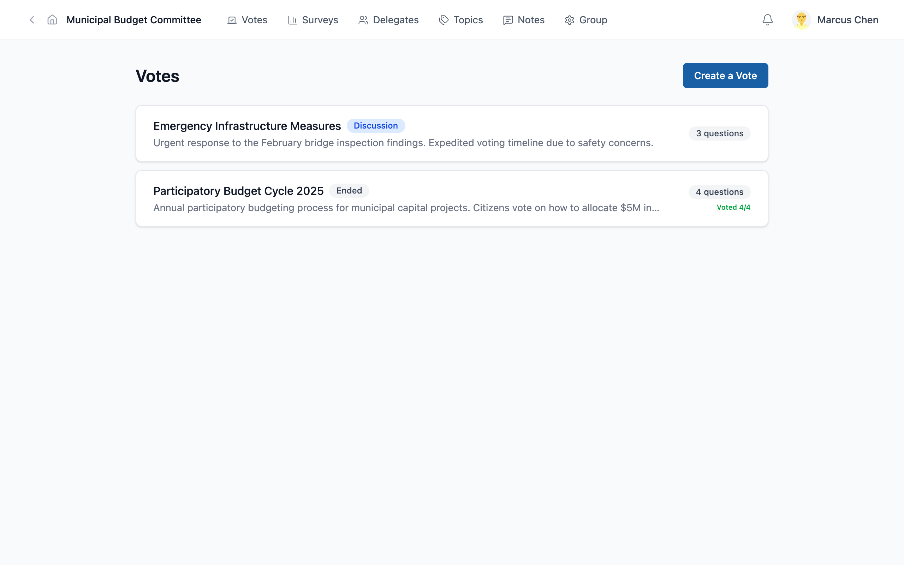
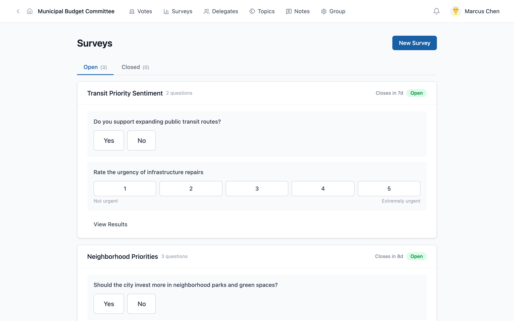
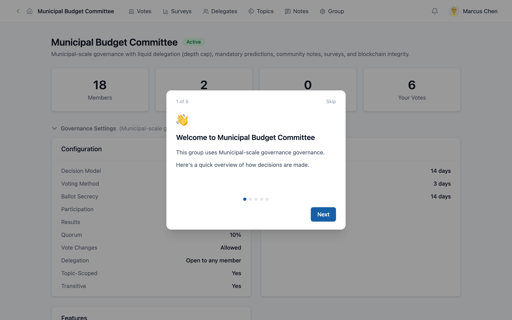
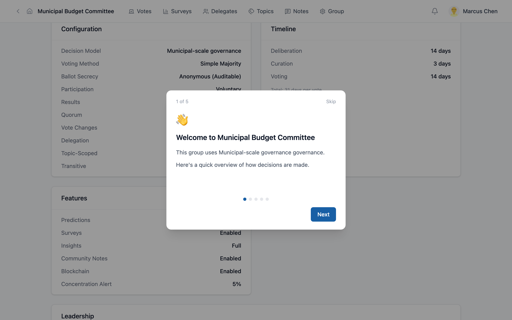

# Case Study: Delegation in a Neighborhood Budget Council

*How a community of 18 residents uses delegation to make better decisions about their shared budget — without requiring everyone to be an expert on everything.*

---

## The Problem

The Municipal Budget Committee is responsible for allocating community funds across infrastructure, social services, and the environment. With 18 members and topics ranging from transit systems to park maintenance, no single person has the expertise to make informed decisions on everything.

The traditional approach — monthly meetings where everyone votes on everything — has predictable problems:

- The retired engineer dominates infrastructure discussions while others tune out
- The social worker's insights on housing are lost in a room focused on road repairs
- Busy parents skip meetings entirely, losing their voice on issues that affect their children
- Decisions get made by whoever shows up, not by the community as a whole

Votiverse solves this with **delegation** — a way for residents to trust specific people on specific topics while keeping the right to vote directly on anything they care about.

---

## How Delegation Works

### Carmen: The Infrastructure Expert

Carmen Delgado is a civil engineer. Her neighbors know she understands transit systems, building codes, and road maintenance better than anyone on the committee. Several residents have delegated their votes to Carmen — not on everything, but specifically on infrastructure topics.

When Carmen logs into her dashboard, she sees the community's governance at a glance:

From the avatar menu in the top right, Carmen can open **Delegators** to see who trusts her with their vote:

Carmen doesn't just vote for herself — when she votes on an infrastructure issue, her vote carries the weight of everyone who delegated to her. This is the core of liquid democracy: **expertise flows to where it's needed**, without requiring a formal election for every committee.

### Nkechi: Trust the Expert, But Vote on What You Know

Nkechi Adeyemi takes a balanced approach. She trusts Carmen on infrastructure — pipes, roads, and transit aren't her area — but she votes directly on everything else. She cares deeply about parks and community events, and wants her voice heard on those topics.

Her delegation page shows this clearly:

When a new vote opens, Nkechi sees a mix: some issues are handled by her delegation to Carmen, while others need her direct input.

This is **topic-scoped delegation** — you choose different people for different subjects. Think of it like choosing a specialist: you trust your mechanic with your car but not your taxes.

> *The key insight: delegation is not giving up your vote. It's choosing the most informed person to cast it on your behalf — and you can always override it by voting directly.*

### Omar: The Delegation Chain

Omar Hadid is a busy restaurant owner. He doesn't have time to research every budget proposal, but he trusts his neighbor Kwame Mensah, who follows community governance closely. Kwame, in turn, trusts Marcus Chen on financial matters.

This creates a **delegation chain**: Omar → Kwame → Marcus.

When Marcus votes, his vote carries the weight of the entire chain — his own plus Kwame's plus Omar's. The awareness layer shows Marcus exactly whose trust he carries, and the system flags concentration whenever one person's delegated weight grows disproportionately large.

### Marcus: Voting with Weight

Marcus Chen is at the end of two delegation chains. When he votes on a budget question, his single action carries the voice of multiple residents:

This is a significant responsibility — and it's visible. Marcus can see exactly whose trust he carries. Other committee members can see the weight distribution. If power concentrates too much in one person, the system flags it.

---

## The Override Rule

Delegation is not permanent surrender. Any resident can vote directly on any issue, and their direct vote **automatically overrides** their delegation for that specific question.

If Carmen delegates to someone else globally but feels strongly about a park renovation proposal, she can vote directly on that one issue. Her delegation still covers everything else.

This is the safety valve that makes delegation safe:
- You delegate broadly when you trust someone's judgment
- You vote directly when you personally care about the outcome
- The system handles the math — no conflicts, no confusion

---

## Structured Deliberation

Before any vote opens, the committee goes through a **deliberation period**. Members review proposals, ask questions, and submit their own arguments.

Emergency Infrastructure Measures — a real-stakes vote about bridge repair funding, traffic management, and resident relocation:

Each issue shows its status: what phase it's in, how many members have voted, whether results are sealed. The committee uses secret ballots so no one is pressured by seeing how their neighbors voted before casting their own ballot.

---

## Surveys: Listening to the Community

Beyond voting, the committee uses **surveys** to capture what residents are actually experiencing on the ground. These aren't opinion polls — they're structured observations: Is the new transit route working? Are park facilities adequate?

Survey responses feed into the accountability system. When a committee member proposes spending $50,000 on transit improvements, the community's survey data can show whether residents actually use transit — grounding decisions in evidence, not assumptions.

---

## Governance Settings: Rules That Don't Change

The committee's governance rules are set at creation and cannot be changed afterward. This protects members from having the rules shifted after they've joined.

Key settings for this community:
- **Delegation**: transitive (chains allowed), topic-scoped
- **Timeline**: deliberation days, then voting days
- **Ballot**: secret, results sealed until voting ends
- **Surveys**: enabled for community observations
- **Predictions**: opt-in for accountability

These rules aren't arbitrary — each one addresses a specific governance need. Concentration alerts flag when delegation power grows disproportionate. Secret ballots prevent coercion. Sealed results prevent bandwagon effects. Surveys ground decisions in evidence.

---

## What This Demonstrates

| Feature | What It Does | The Governance Problem It Solves |
|---------|-------------|----------------------------------|
| **Delegation** | Trust someone to vote on your behalf | Busy residents don't lose their voice |
| **Topic scoping** | Different delegates for different subjects | Expertise flows to where it's needed |
| **Delegation chains** | Trust flows through multiple people | Flexible representation without formal elections |
| **Concentration alerts** | Flags when one person carries disproportionate weight | Prevents invisible power concentration |
| **Override rule** | Direct vote overrides delegation | No one permanently surrenders their voice |
| **Weight visibility** | See how many votes each person carries | Transparency in representation |
| **Secret ballot** | Votes hidden until voting closes | Free participation without coercion |
| **Surveys** | Structured community observations | Ground decisions in evidence |
| **Sealed results** | No results until everyone has voted | Prevent bandwagon effects |

The fundamental promise: **every voice counts, but not everyone needs to be an expert on everything.** Delegation lets a community leverage its collective expertise while preserving individual sovereignty.

---

*This case study uses data from a running Votiverse instance. Screenshots were captured with Playwright and can be regenerated with `npm run screenshots:neighborhood`.*
