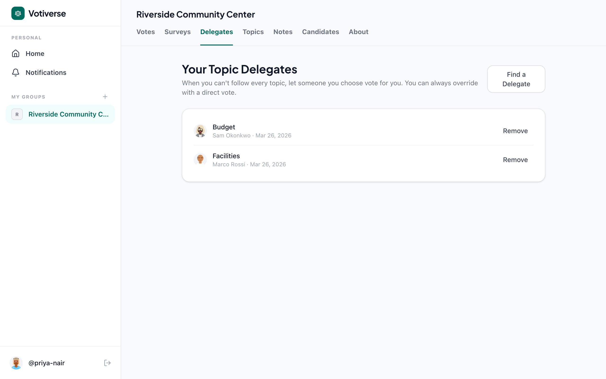
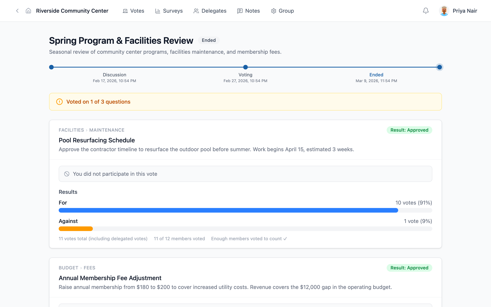
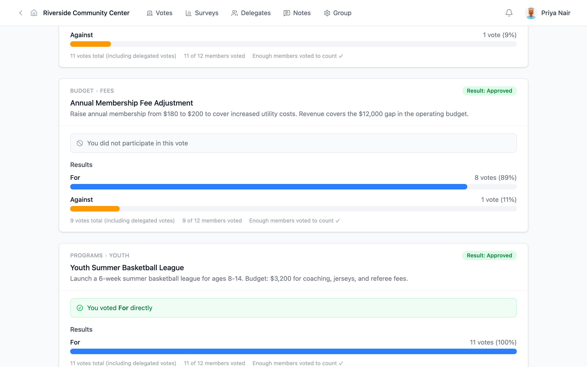
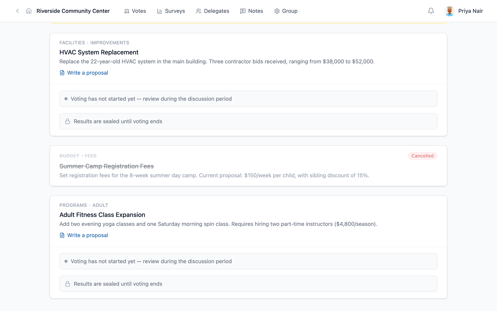
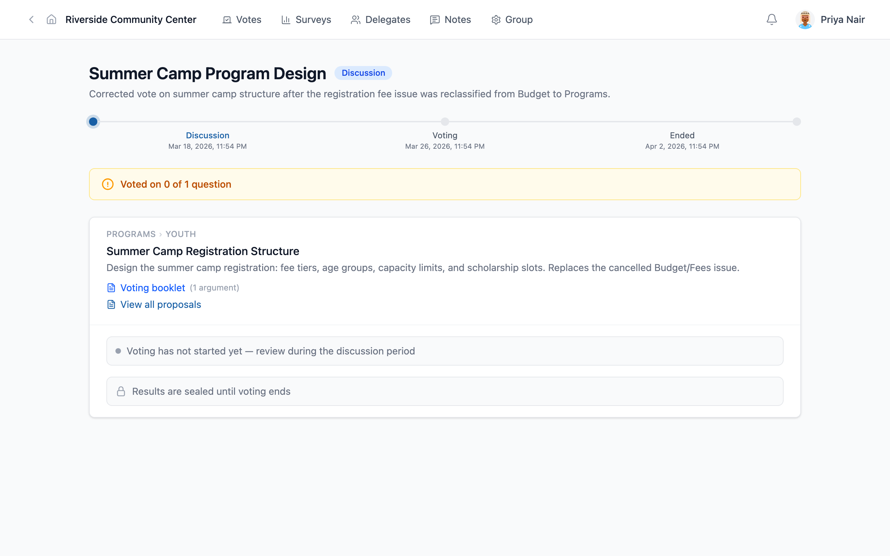

# Why Topic Classification Matters

*A community center learns that how you categorize a vote determines who decides.*

## The Setting

The Riverside Community Center serves 200 families. Twelve board members make decisions about everything from pool maintenance to youth programs to membership fees. They use Votiverse with topic-scoped delegation: members who trust someone's expertise on a topic can delegate their vote on that topic while voting directly on everything else.

Their topic taxonomy is simple — two levels deep, easy to scan:

- **Programs** — Youth, Adult
- **Facilities** — Maintenance, Improvements
- **Budget** — Fees, Grants

This structure matters more than it might seem. When a vote is classified under "BUDGET › FEES," different people carry voting weight than when the same question is classified under "PROGRAMS › YOUTH." Topic classification isn't just an organizational convenience — it's a governance decision.

## Priya's Delegation: Trust by Domain

Priya Nair is a working parent. She cares about the community center but can't attend every meeting or research every issue. She's set up two topic-scoped delegations:

- **Sam Okonkwo** handles her vote on **Budget** topics — he's the finance committee chair and she trusts his judgment on money matters.
- **Marco Rossi** handles her vote on **Facilities** topics — he's a retired contractor who knows building systems.

For everything else — programs, events, community decisions — Priya votes herself.

This is the core idea behind topic-scoped delegation: you don't have to be an expert on everything. You choose who to trust, and on what.

## Spring Review: Topic Badges in Action

In the spring review vote, each issue shows its topic as a badge before the title. At a glance, Priya can see which of her delegates is handling what:

- **FACILITIES › MAINTENANCE** — Pool Resurfacing: Marco voted for Priya (she sees her vote was delegated).
- **BUDGET › FEES** — Membership Fee Adjustment: Sam voted for Priya.
- **PROGRAMS › YOUTH** — Youth Basketball League: Priya voted directly.

The results reflect this. The fee adjustment shows 9 votes total — Sam's single vote carried the weight of four people (himself plus Priya, David, and Kwesi, who all delegate Budget to him). The basketball league shows 11 votes with Leah Chen carrying three (herself plus Janet and Nina, who delegate Programs to her).

The numbers aren't just arithmetic. They tell a story about who the community trusts to make which decisions.

## The Misclassification

In the summer planning vote, Diana Reyes (the center director) creates three issues. One of them — "Summer Camp Registration Fees" — is classified under **BUDGET › FEES**.

This seems reasonable. Registration fees are about money, right?

But Leah Chen, the youth programs coordinator, sees a problem. She writes a community note on Sam's fee schedule proposal:

> This proposal treats camp registration as a budget line item, but the real question is program design. The fee structure determines who can attend — age groups, scholarship slots, capacity limits. That's a youth program decision, not a finance one.

The classification under Budget means Sam carries four delegated votes on this issue. But those members delegated their *budget* judgment to Sam, not their *youth program* judgment. Leah, who people trust on youth programs, has no delegated weight here.

Four members endorse Leah's note. The community agrees: the classification is wrong.

## The Correction

Diana cancels the misclassified issue. It stays in the record — struck through with a red "Cancelled" badge — as a transparent audit trail. Nothing is deleted.

She creates a new vote: "Summer Camp Registration Structure," classified under **PROGRAMS › YOUTH**.

Now Leah's proposal — which focuses on inclusive design, scholarship tiers, and age-appropriate groupings — sits in the voting booklet. And Leah carries the delegated weight of the two members who trust her on youth programs.

The same question, reclassified. Different people carry weight. Different proposals lead the conversation. Potentially a different outcome — and a more legitimate one, because the people making the decision are the ones the community chose to trust on *this kind of question*.

## Issue-Scoped Delegation

The summer planning vote also includes an HVAC system replacement — a complex facilities question involving contractor bids ranging from $38,000 to $52,000. Tomas Herrera, a newer member, doesn't know enough about HVAC contracts to vote wisely. But he doesn't want to delegate *all* Facilities topics to Marco permanently — just this one issue.

He uses issue-scoped delegation: "This issue only." Marco gets Tomas's vote on the HVAC question specifically, but Tomas keeps his voice on every other issue, including future Facilities votes.

This is the most specific form of trust in Votiverse. It sits at the top of the precedence chain:

1. **Issue-scoped** — "trust you on this one question"
2. **Child topic** — "trust you on Youth programs"
3. **Parent topic** — "trust you on all Programs"
4. **Global** — "trust you on everything"

A more specific delegation always overrides a more general one.

## What This Demonstrates

| Feature | Governance principle |
|---------|---------------------|
| Single topic per issue | Every vote has one clear classification — no ambiguity about which delegations activate |
| Topic eyebrow with › chevron | Voters immediately see which domain a vote belongs to |
| Topic-scoped delegation | Expertise flows where it's needed without surrendering your voice everywhere |
| Issue-scoped delegation | Specific trust for a single question, without long-term commitment |
| Community notes | Collective oversight of the governance process itself, not just the issues |
| Issue cancellation | Errors can be corrected without breaking the audit trail |
| Max depth 2 | The taxonomy stays understandable — you don't need a manual to use it |

The Riverside story shows why topic classification is a first-class governance concern, not a filing detail. When you get it wrong, the wrong people make the decision — not because anyone acted in bad faith, but because the system routed trust in the wrong direction. Community notes and issue cancellation give the group the tools to catch and correct these mistakes transparently.
